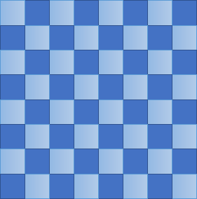
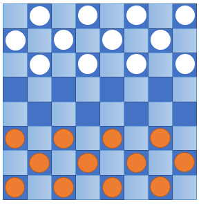
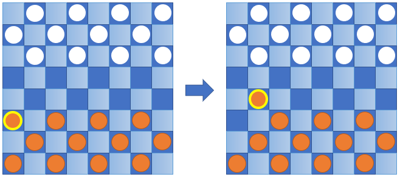
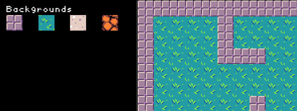

# From Board Games to TileCode Games

Board games like checkers (also known as draughts) have been played for thousands of years of human history. 
Checkers and chess are both played on a **board** with 64 **squares** arranged in an 8x8 two-dimensional **grid**. 
The squares are alternating colored in each row and column, creating a checkered pattern:

 
Game **pieces** are placed in their initial **positions** on the squares of the board and game play begins, 
such as in checkers:

Each player takes a **turn**, which consists of moving a single piece on the board 
from its square to another square, and possibly removing other pieces. 

The **rules** of the game (checkers, chess, etc.) define the **permitted moves** for 
a piece, given its kind and the current positions of the pieces on the board. 

For example, in checkers, a piece may be moved diagonally into an adjacent unoccupied square:

## From Boards to Tile Maps

TileCode video games are similar to board games. 
A TileCode game takes place on a **tile map**, which is similar to the board in a board game. 
Like the squares of a board, the **tiles** of a tile map are arranged in a grid. 

A tile map visually represents a scene in which the action of the game takes place. 
The tile backgrounds may represent entities such as barriers (walls), pathways, etc. 
On the right-hand side below is a part of a tile map that uses just two backgrounds 
(wall and grass) from the four backgrounds listed on the left-hand side:

The main differences of a tile map compared to a board are:
- a tile map can be much larger than a chess or checker board, and does not need to be square
- each tile can be ``painted’’ with **background** art, chosen from a gallery of artwork
- a tile's background art can be changed during the game 

It’s easy to create your own physical tile map using construction paper (of assorted colors) 
and scissors, or with color pencils/marks and paper. A large set of paper tiles of various 
colors will allow for a lot of creativity on a table and provide topics for discussion and 
collaboration.

## From Pieces to Sprites

Board games feature pieces, which are **movable** objects. 
Each piece may have a different **kind**, signified by its form, that defines the moves it may make.
In chess, pieces are of six kinds (king, queen, knight, bishop, rook, pawn) and
the permitted moves for a piece are determined by its kind and the positions of
the pieces on the board, also called the **state** of the board.  

Each piece that is ``in play'' occupies a single square of the board. 
In most board games, there is at most one piece on a square (though in checkers, 
one may "crown" a checker with another checker to create a king, which has the 
capability to move backward as well as forward). 

In TileCode games, **sprites** are the digital counterparts of pieces. Each sprite is a moveable object that 
has a kind (with an associated image) and a position on the tile map. Here is the tile map from above with a 
few sprites positioned on it:

The main differences of a sprite compared to a piece are:
- there can be multiple sprites (overlapped) on a tile
- a TileCode sprite moves in one of four directions (up, down, left, or right), one tile at a time
- a TileCode sprite remembers the direction it last moved

## From Turns to Continuous Action

Most board games are turn-based and take place between two or more players. 
On the other hand, many video games are single player and have no concept of turn-taking.
Video games often have the concept of a **player avatar**, a unique sprite 
that the player controls via keyboard, mouse, game controller, or touch.
Furthermore, video games contain **non-player characters**, which are represented
by sprites that move on their own, based on how they are programmed.
Finally, compared to turn-based board games, where each player may spend quite a bit of
time observing the game board before thinking before making their next move, 
many video games involve **continuous action** where the player does not have much
time to decide what to do next. 

