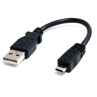
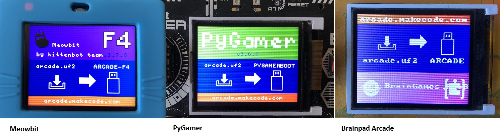
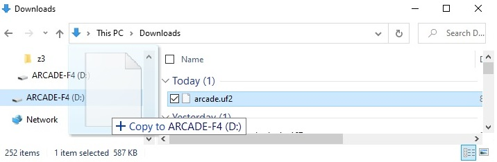
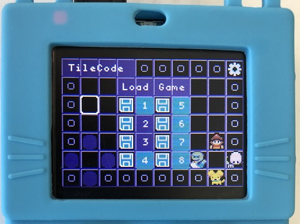

## Copying the TileCode UF2 File to an Arcade Device

On this page, you'll find detailed instructions for installing the [TileCode UF2 file](https://github.com/microsoft/tilecode/releases/download/v4.2.8/arcade.uf2) to your Arcade device, after you've downloaded it to your computer (by clicking on the above link) and saved it to a file (probably named **arcade.uf2**). Don't try to open the file as it's not human readable.

### Micro-USB Cable

You need a micro-USB cable to connect your Arcade device to the USB port on your computer:

The small end of the cable plugs into your Arcade device. The larger end plugs into the USB slot on your computer. You should make sure your Arcade device is **turned off** when you connect the cable to it and plug it into your computer.

### Turn On Device, Find Device as a Drive, and Copy File

Now, turn on your Arcade device. It should automatically enter "file copy" mode and display a screen that indicates the device is ready to receive your **arcade.uf2** file:

Furthermore, the device should appear as a drive on your computer. For example, on Windows, you should find a new drive (usually with **ARCADE** in its name) in the Windows File Explorer:

Now, you need to find the **arcade.uf2** file you downloaded and copy it to the drive with **ARCADE** in its name, as shown below:

This will take some time during which you might see a file copy window. When the file copy operation completes, the Arcade device will reboot and you should see the TileCode home screen:

### Troubleshooting

See the [frequently asked questions](faq) if you are having problems with the above steps. 

