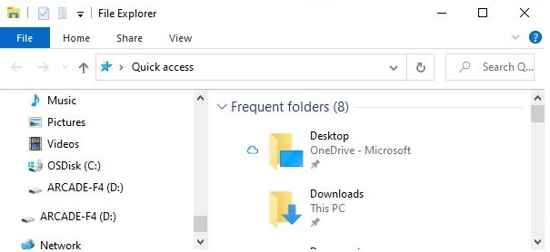

## Copying the TileCode UF2 File to an Arcade Device

On this page, you'll find detailed instructions for installing the [TileCode UF2 file](https://github.com/microsoft/tilecode/releases/download/v4.2.6/arcade.uf2) to your Arcade device, after you've downloaded it to your computer (by clicking on the above link) and saved it to a file (probably named **arcade.uf2**). Don't try to open the file as it's not human readable.

## Micro-USB Cable

You need a micro-USB cable to connect your Arcade device to the USB port on your computer:

The small end of the cable plugs into your Arcade device. The larger end plugs into the USB slot on your computer. You should make sure your Arcade device is **turned off** when you connect the cable to it and plug it into your computer.

## Turn On Device, Find Device as a Drive, and Copy File

Now, turn on your Arcade device. It should automatically enter "bootloader" mode and display a screen that indicates the device is ready to receive a UF2 file:

Furthermore, the device should appear as a drive on your computer. For example, on Windows, you should find a new drive (usually with **ARCADE** in its name) in the Windows File Explorer:

Now, you need to find the **arcade.uf2** file you downloaded and copy it to the drive with **ARCADE** in its name, as shown below:

This will take some time during which you might see a file copy window. 

## Troubleshooting

### Problem: device does not display bootloader screen

If it does not, put your device into "bootloader" mode by pressing the reset button on the device. The **reset** button is located in different locations on the [MakeCode Arcade devices](https://arcade.makecode.com/hardware/):

- Kittenbot [Meowbit](https://www.kittenbot.cc/collections/frontpage/products/meowbit-codable-console-for-microsoft-makecode-arcade): **reset** is on the upper-right side of the device
- GHI [Brainpad Arcade](https://www.brainpad.com/): **reset** is on the upper-right of the front of the device
- Adafruit [PyBadge](https://www.adafruit.com/product/4200), [PyGamer](https://www.adafruit.com/product/4242) and [EdgeBadge](https://www.adafruit.com/product/4400): **reset** is on the upper-left of the back of the device
- Kitronix [ARCADE](https://kitronik.co.uk/products/5311-arcade-for-makecode-arcade): **reset** is above the screen on the front of the device
- TinkerGen [GameGo](https://shop.tinkergen.com/gamego.html): **reset** is at the bottom of the front of the device, to the right of the Menu button

### Problem: device displays bootloader screen but does not show as a drive on computer

It might be that your micro-USB cable is faulty (or is a power-only cable). Try a different cable. 
