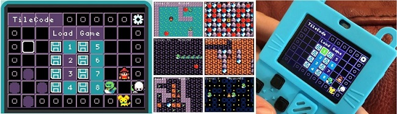

## Introduction and Videos

TileCode is a game creation app that allows you to design and play games directly 
on low-cost [MakeCode Arcade](https://arcade.makecode.com){:target="_blank"} devices or in a web browser. TileCode games are similar to board games with pieces that can move from one tile of the board to a nearby tile. Click on the two images below to watch a 30 second video (left) and a 5 minute video (right) about TileCode:
  
{:target="_blank"} {:target="_blank"} 

## TileCode on Arcade Devices and the Web Browser

TileCode runs on any [MakeCode Arcade device](https://arcade.makecode.com/hardware){:target="_blank"} - here are [detailed instructions](download) on how to download and copy the [TileCode UF2 file](https://github.com/microsoft/tilecode/releases/download/v4.2.7/tilecode.uf2) file to your Arcade device. You also can run TileCode in the web-based MakeCode Arcade simulator at bottom of this screen. Clicking on the lower right corner of the screen (arrow icon pointing down and to the right)  expands the game simulator to **full screen mode**. 

Both the UF2 file and the game simulator come loaded with six sample games in the following slots: (1) Hello World, (4) Snake, (5) Boulder Dash, (6) Sokoban, (7) Pac-Man, and (8) Bejeweled. The first game is a very simple example. The other games are simplified versions of five popular games that together demonstrate all of TileCode's programming features.

## Background Reading

* [From Board Games to TileCode Games](board)
* [Game Mechanics](mechanics)

## Overview

* [TileCode App Overview](tilecodeapp)
* [Hello World Game](helloworld)
* [TileCode Programming](language)

## Having Problems?

Please file a [GitHub issue](https://github.com/microsoft/tilecode/issues){:target="_blank"} if you encounter 
a problem with TileCode. You can also help us by choosing the most appropriate tag for your issue.  If you can't
file an issue, mail us at [tilecode@microsoft.com](mailto:tilecode@microsoft.com)
