## Patterns of Game Play

A game is composed of various [game mechanics](mechanics). Below you'll find
a variety of different mechanics that you can use as a starting point for 
developing your own game. We illustrate the mechanics using a variety of games.

## Game 1: Dog, Cats, and Snakes!!!

### Player Movement

The player sprite typically is controlled using the four-way direction pad (dpad).
Here is a tile map where the player sprite is a dog and four types of tile
backgrounds are visible (grey wall, orange sand, blue/green grass, and dark grey sand):

If we want the user to be able to move the dog only on the orange sand, we can use the following rule:

With this rule, the dog will not be able to move onto any other tile than orange sand.  If we want the dog to be able to move anywhere except the wall, then we can use the following rule instead:

Here's how you change the first rule to the second rule:

### Dog Pushes Cat

In various games, the player sprite can push another object. Here is a rule that allows the player's dog to push a cat around by sending a move right command to both the dog and cat when the cat is immediately to the right of the dog (and the dpad-right button is pressed):

Create a tile map with several cats and try pushing them around:

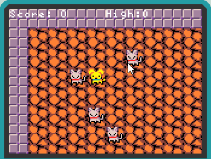

Notice that the dog can push a cat anywhere, including onto another cat or onto a wall.  We create a rule to stop the cat from moving if it is going to smash into the wall:

Make sure to generalize the rule to all four directions! You can create a separate smash rule to prevent a cat from smashing into a cat as well:

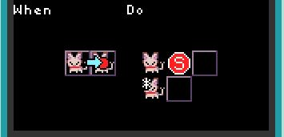

These two rules will prevent a cat from being pushed onto a wall or onto another cat but will still allow the dog to move onto a tile containing a cat.

### Non-Player Character Movement

Many games have characters that move of their own accord. Let's put some snakes in a pond and have the snakes move back and forth: 

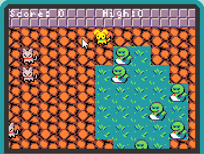

We will use the change quadrant in the rule selector screen to code four rules for the snake sprite, starting with the snake at rest:

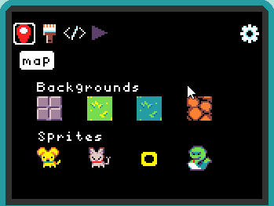

When the snake is at rest and there is water to the left of the snake, we send the snake a move-left command:

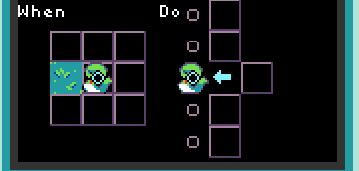

When the snake has just moved left and there is water to the left of the snake, we send it a move-left command :

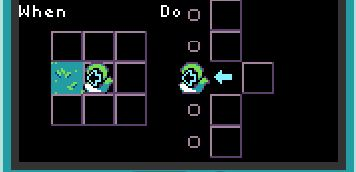

When the snake has just moved left and there is sand to the left of the snake, we send the snake a move-right command:

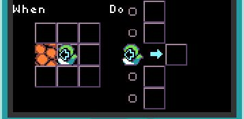

When the snake has just moved right and there is water to the right of the snake, we send it a move-right command:

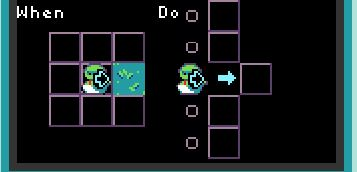

### Painting Tiles and Move on Change

The snakes know that the cats don't like water, so every time they get to the left edge of the pond, they take a bite of the orange sand to expand the pond's boundary to the left:

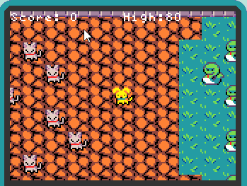

This is done by modifying the rule that makes the snake turn right when it meets orange sand:

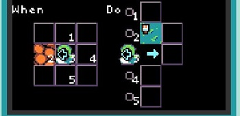

As the cats don't like water, whenever there is water to their right, they move one tile to the left (as long as there is no wall to their left):

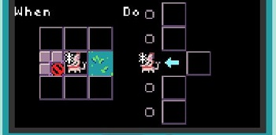

### Scoring and Game Over Conditions

To make the game more interesting, we introduce scoring and a game over condition, supported by the tile map below. We put the light beige tile ("kitty litter") on the left and right sides of the map to give the cats a place to stay away from the snakes.  The goal of the game is for the dog to help as many cats as possible get to the kitty litter on the right side of the pond:

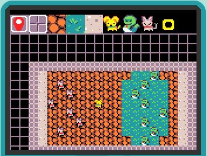

Whenever the cat moves right onto the kitty litter (lining the right side of the game map), the score is increased by ten points:

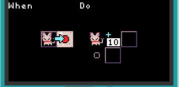

The game is over when there is no tile that contains both a cat and the orange sand:

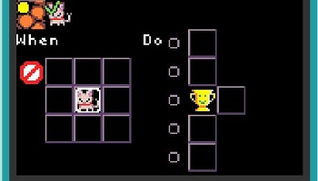

Finally, when a cat or dog runs into a snake, the game also is over:

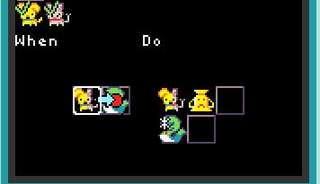

### Projectile Movement

For the dog to get cats to the right side of the pond, it must able to beat back the advance of the pond towards the cats. It does so by firing projectiles towards the pond. When these projectiles hit the water, they turn the water back into sand:

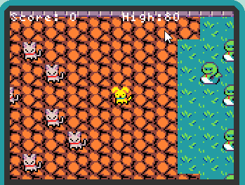

When the A button is pressed, we create a projectile and send it a move-right command:

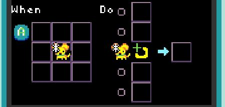

Once created, the projectile always move to the right:

When the projectile is going to collide with water, the projectile is destroyed and water painted over by orange sand:

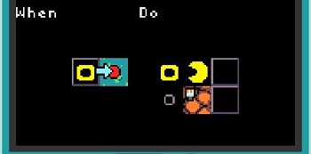

## Game 2: Jumping Dog

The second game is called a "side-scroller" for reasons that should be obvious from the snapshot of the game below:

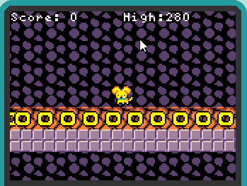

The mechanics of the game are quite simple: the user presses the A button to make the dog jump and the goal is avoid hitting snakes, which move from right to left. 

### The conveyor belt.

As the dog remains in the center of the screen, we put a number of other sprites into motion to give the game more dynamism. The conveyor belt of yellow blocks is in constant motion from right to left.  We design the game map as follows:

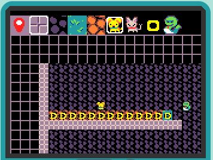

In particular, the blue tile on the right marks the "beginning" of the conveyor belt, which ends with the wall tile on left. Neither the blue tile nor the wall tile on the left are visible to the player (we call these "off stage" elements).

The following rule keeps the conveyor belt moving left as long as there is an orange tile to the left of the yellow block:

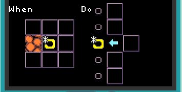

The second rule destroys the yellow block that is next to the wall, opens a portal to the blue tile, creates a new yellow block at that tile, and sends the sprite a move left command.

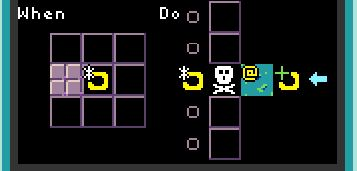

Together, the above two rules create illusion of a never-ending always-moving conveyor belt.

### Basic snake rules

Snakes always move left:

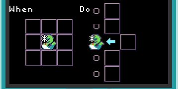

If a snake smashes into the dog, then it's game over:

### New snakes at random

Let's turn now to making the snakes appear at random intervals using more "offstage" elements and the portal command. Below is a view of the tile map offstage where three snakes are placed initially and where new snakes are created:

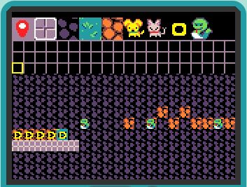

Recall that the portal command opens a portal to a tile that has a particular background, but contains no sprites. We use the orange offstage tiles as the area to create new sprites, as shown above.  Here is the rule for spawning a new snake, which fires when a snake reaches the wall on the left:

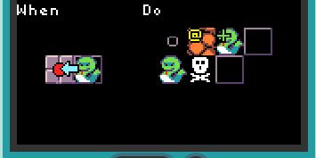

This rule destroys the current snake, opens a portal to an orange tile (not already containing a sprite), and creates a new snake at that tile. By design, if there are multiple orangel tiles that a portal could be opened to to, TileCode chooses one of the available tiles at random.

### Dog Jumps and Scores!

Finally, we use the A button to allow the dog to jump up one tile, but only if the dog has a yellow block immediately below it:

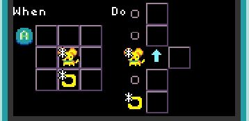

We also need to arrange for the dog to fall back down when there is blank space below it:

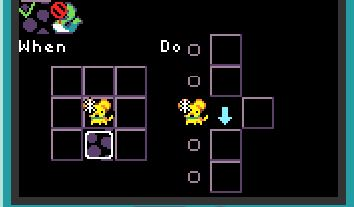

Note that we don't allow the dog to fall down if there is snake below it (the dog gets to "walk" over a snake it has jumped to avoid). 

Finally, whenever the dog is directly above a snake, the score gets bumped up:

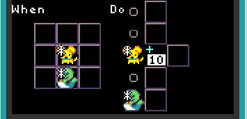