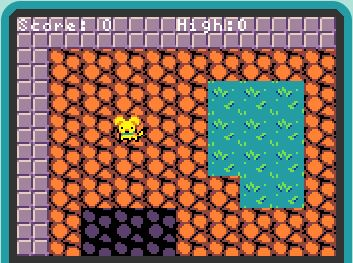
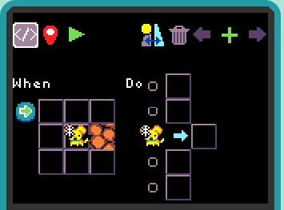
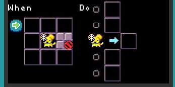
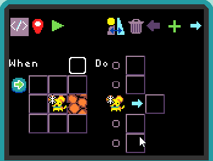
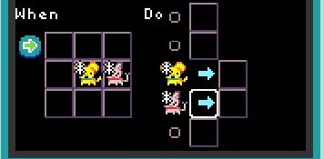
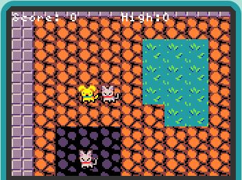
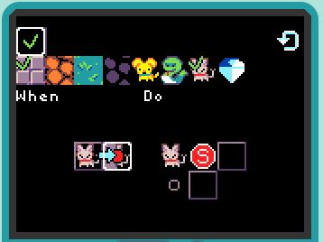
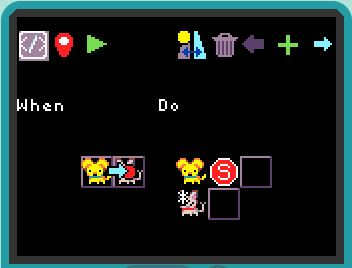

## Patterns of Game Play

A game is composed of various [game mechanics](mechanics). Below you'll find
a variety of different mechanics that you can use as a starting point for 
developing your own game.

## Player Movement

The player sprite typically is controlled using the four-way direction pad (dpad).
Here is a tile map where the player sprite is a dog and four types of tile
backgrounds are visible (grey wall, orange sand, blue/green grass, and dark grey sand):

If we want the user to be able to move the dog only on the orange sand, we can use the following rule:

With this rule, the dog will not be able to move onto any other tile than orange sand.  If we want the dog to be able to move anywhere except the wall, then we can use the following rule instead:

Here's how you change the first rule to the second rule:

## Dog Pushes Cat

In games like Boulder Dash and Sokoban, the player sprite can push another object. Here is a rule that allows the player's dog to push a cat around:

Create a tile map with several cats and try pushing them around:

Notice that you can push a cat anywhere, including onto another cat or onto a wall.  We create a rule to stop the cat from moving if it is going to smash into a wall or another cat:

Make sure to generalize the rule to all four directions! This rule will prevent a cat from being pushed onto a wall or another cat but will still allow the dog to move on top of a cat.  If you don't want that to happen, then you need add another smash rule to stop the dog moving if it is going to smash into a cat:

## Projectile Movement

Many games allow a player to shoot a projectile in a given direction.

## Non-Player Character Movement

