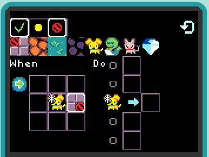

## Patterns of Game Play

A game is composed of various [game mechanics](mechanics). Below you'll find
a variety of different mechanics that you can use as a starting point for 
developing your own game.

## Player Movement

The player sprite typically is controlled using the four-way direction pad (dpad).
Here is a tile map where the player sprite is a dog and four types of tile
backgrounds are visible:

If we want the user to be able to move the dog only on the orange sand, we can use the following rule:

With this rule, the dog will not be able to move onto any other tile than orange sand.  If we want the dog to be able to move anywhere except the wall, then we can use the following rule instead:

We create the above rule by selecting the "never" red-slash-circle and applying it to the wall background:

## Player Pushes Object

In games like Boulder Dash and Sokoban, the player sprite can push another object.

## Projectile Movement

Many games allow a player to shoot a projectile in a given direction.

## Non-Player Character Movement

