---
# this is an empty front matter
---

# Getting Started

You can run TileWorld in your [web browser](https://microsoft.github.io/pxt-tileworld/), or on any [MakeCode Arcade device](https://arcade.makecode.com/hardware). Simply copy the appropriate [UF2 file](https://github.com/microsoft/pxt-tileworld/releases/) to your MakeCode Arcade device to get started. 

# Overview

* [Load Screen and Navigation](#loadscreen)
* [Game Home Screen](#gamehome)
* [Coding in TileWorld](#coding)
* [Sharing TileWorld Games](#sharing)
* [Having Problems?](#issues)

# Load Screen and Navigation {#loadscreen}

The load screen of TileWorld lets you select one of four games to program and play. All game assets (game board, images and code) are stored in the flash memory of your Arcade device, so your changes will remain even if you power the device off. All editing takes place via the tile paradigm: move the square-shaped cursor between adjacent tiles using the direction pad (dpad); select a tile using the A button to perform an action; the B button takes you back (to the menu of the current screen or to the previous screen). Assets are saved to flash whenever you transition between screens.

# Game Home Screen {#gamehome}

Let's load the game in slot 1, which takes us to the game's home screen, as shown below:

Each TileWorld game has four kinds of map tiles and four kinds of sprites to work with. Let's take a quick tour through the various screens you can get to from the home screen. Move the cursor around the screen to get help about all the features available. Let's visit the art gallery to change the art associated with the fourth sprite (the skull).

## Gallery

We move the cursor to the puppy dog and select it (A button) 

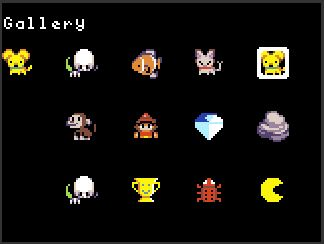

Now, when we return to the game home screen, we can see the skull has been replaced by the puppy:

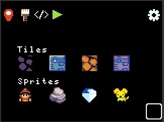

## Menu bar

The menu bar of the game screen has four main commands in addition to the setting (gear wheel): world map editor, paint tile/sprite art, code editor, and play game.

### Map

The map editor lets you paint the game world's tiles and place sprites on tiles. Select one of the four tiles and move your cursor down to the map. Press A to color a tile. Press B to return to the menu bar and select another tile. After selecting a sprite, the A button will place the sprite on a tile, replacing the  sprite that is there (or removing it if it is the same as the selected sprite). 

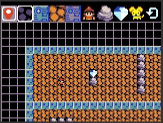

You can color tiles quickly by holding down the A button while moving the cursor. The reset button (upper right) resets the camera to the upper left of the map. To return to the game screen, press the B button (B always takes you back).

### Paint

The paint editor lets you change the art associated with a tile or sprite. As with the map editor, select the tile/sprite whose art you want to change. Here we have selected the puppy dog:

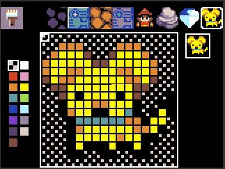

Move your cursor down to edit the bitmap (using the A button to apply the currently selected color).  Press B to move from the bitmap pane to the color selector. After selecting a color, move your cursor back to the bitmap pane to resume coloring. We have colored the puppy's eyes red:

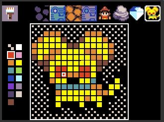

### Code

The coding page shows the four kinds of sprites on the left and the different types of rules available. We have selected the boulder sprite - the highlighted squares represent the rules we have coded to give the boulder its behavior (note that there are no rules highlighted for the direction pad in the upper right).

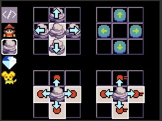

Selecting the boulder in the middle of the upper left quadrant brings up the rule editor:

This rule applies to a boulder ``at rest'' and starts the boulder moving down when there is a space below the boulder. More details about programming rules are given below.

### Play

The play button runs the game in full screen mode. Press B to exit the game.  Try to collect all the diamonds without having a boulder fall on you or getting caught by the skull/puppy

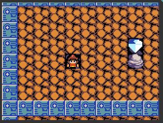

### Settings

Once you get used to the features available in TileWorld, you can turn off the help suggestions via the gear wheel, which takes you to the settings screen. 

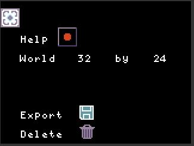

# Coding in TileWorld {#coding}

Each sprite's behavior is governed by a set of rules that you can program. Let's start with a fresh game. Go to the load screen and select game slot #2.  If you play the game, you'll see that you can move the player sprite around with the direction pad.  Let's look at the rules for the player sprite:

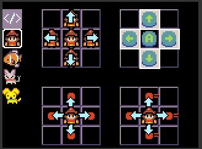

No surprises here: the rules for the direction pad (upper right quadrant) are lit up. Move the cursor over to the left dpad button:

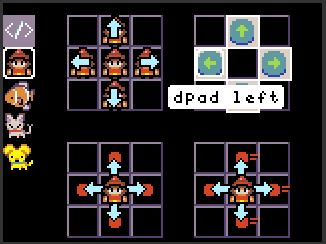

Now press A to bring up the rule editor. The editor is divided into two main sections: *When* and *Do*. The *When* section shows a pattern around the player. To the left of the player is a wall tile with a 

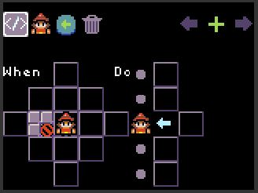

# Sharing Your TileWorld Games {#sharing}

The easiest way to share a TileWorld game you have created on an Arcade device is to copy the UF2 file from your device and share it with your friend. The UF2 file includes the flash settings in which your games are stored. When your friend copies this UF2 file to their Arcade device, they will get the games you created. Keep in mind that if your friend's Arcade device is not the same as yours, this may not work.

# Having Problems? {#issues}

Please file a [GitHub issue](https://github.com/microsoft/tileworld/issues) if you encounter a problem with TileWorld
