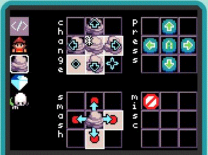
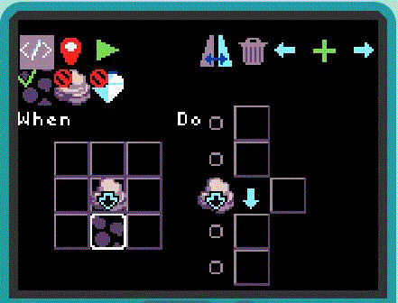

# Introduction

TileCode is a game creation app that allows you to design and play games directly on MakeCode Arcade devices. 
TileCode games are based on the familiar paradigm of a gameboard with pieces that can move from one tile of 
the board to an adjacent tile. You can run TileCode: 
* in a [web browser](https://microsoft.github.io/tilecode/), or 
* on any [MakeCode Arcade device](https://arcade.makecode.com/hardware).

Copy this [UF2 file](https://github.com/microsoft/tilecode/releases/download/v3.5.5/arcade-all.uf2) to your 
device to get started (works for all MakeCode Arcade devices).

# Overview 

* [Tour of TileCode](#tour)
* [Coding in TileCode](#coding)
* [Sharing TileCode Games](#sharing)
* [Having Problems?](#issues)

# Tour of TileCode {#tour}

Let's take a quick tour through the various screens of TileCode.  All editing takes place via the tile paradigm: 
* move the square-shaped cursor between adjacent tiles using the direction pad (dpad); 
* select a tile using the **A** button to perform an action; 
* press the **B** button to take you back to the menu of the current screen or to the previous screen

## Load Screen

The load screen of TileCode lets you select one of eight games to program and play (slots colored blue already have game assets):

 All game assets (gameboard, images and code) are stored in the flash memory of your Arcade device, so your changes will remain even if you power the device off. Assets are saved to flash whenever you transition between screens.

## Game Home Screen

The game's home screen displays after a game slot has been selected:

Each TileCode game has four kinds of tile backgrounds and four kinds of sprites to work with, as shown on the screen.  You can visit the art gallery to change the background art or sprite art by selecting the background/sprite. 

## Gallery

In the gallery, simply move to the artwork you wish and select it with the **A** button:

As usual, use the **B** button to return to the game home screen.

## Menu bar

The menu bar of the game home screen has four main commands in addition to the gear wheel (for game settings): 
* tile map editor (red map icon)
* bitmap editor (paint brush icon) 
* rule selector (</> icon)
* play game (green play icon)

## Tile Map Editor

The tile map editor lets you paint the game world's tiles and place sprites on tiles. 
Select one of the four backgrounds and move the cursor down to the map. 
Press **A** to paint a tile with the current background. 
Press **B** to return to the menu bar and select another background or sprite. 
After selecting a sprite, the **A** button will place the sprite on a tile, 
replacing the sprite that is there (or removing it if it is the same as the selected sprite). 

You can paint tiles quickly by holding down the **A** button while moving the cursor. 
The reset button (upper right) resets the camera to the upper left of the map. 
To return to the game screen, press the **B** button.

## Bitmap Editor

The bitmap editor lets you change the art associated with a tile or sprite.

 As with the map editor, select the tile/sprite whose art you want to change. 
 Move the cursor down to edit the bitmap (using the **A** button to apply the currently selected color).  
 Press **B** to move from the bitmap pane to the color selector (pressing **B** again will take you back to the top menu).
 Selecting a color will send the cursor back to the bitmap pane so you can resume painting where you left off. 

## Rule Selector

The rule selector screen shows the four kinds of sprites on the left and the different 
types of rules available (**change, press, smash, miscellaneous**).  A tile is highlighted
if there is a rule of that type present. Select a tile to create a new rule or visit an
already present rule. 

## Rule Editor

A rule takes the form of a **When-Do** guarded command. The **When** guard is a predicate/pattern
over the 3x3 local neighborhood around the central sprite. When the guard matches on
the tile map, the commands in the **Do** section execute. More details about programming rules are given below.

## Play

The play button runs the game in full screen mode. Press **B** to exit the game. 

## Settings

Once you get used to the features available in TileCode, 
you can turn off the help suggestions via the gear wheel, 
which takes you to the settings screen. 

# Coding in TileCode {#coding}

Coding in TileCode is done by creating a set of rules to determine the sprite’s behavior. Let’s start with a fresh game example. Go to the load screen and select game slot #1 which will open "Hello Apple" game. If you play the game, you’ll see that you can move the player sprite around with the direction pad. The player goal is to eat as many apple as possible while avoiding the snakes. 

Let’s learn how we can create this game step by step. 

* Step 1: Delete an existing game to make space for this game. Go to one of the existing slots and then click on the settings wheel and select "delete" button. 

# Sharing Your TileCode Games {#sharing}

The easiest way to share a TileCode game you have created on an Arcade device is to copy the UF2 file from your device and share it with your friend. The UF2 file includes the flash settings in which your games are stored. When your friend copies this UF2 file to their Arcade device, they will get the games you created. Keep in mind that if your friend's Arcade device is not the same as yours, this may not work.

# Having Problems? {#issues}

Please file a [GitHub issue](https://github.com/microsoft/tilecode/issues) if you encounter a problem with TileCode.
