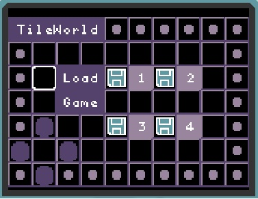
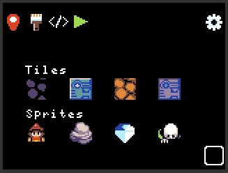
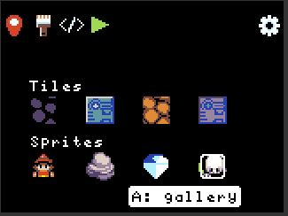

---
# this is an empty front matter
---

# Getting Started

You can run TileWorld in your [web browser](https://microsoft.github.io/pxt-tileworld/), or on any [MakeCode Arcade device](https://arcade.makecode.com/hardware). Simply copy the appropriate [UF2 file](https://github.com/microsoft/pxt-tileworld/releases/) to your MakeCode Arcade device to get started. 

# Overview

* [Load Screen and Navigation](#loadscreen)
* [Game Home Screen](#gamehome)
* [Coding in TileWorld](#coding)
* [Sharing TileWorld Games](#sharing)
* [Having Problems?](#issues)

# Load Screen and Navigation {#loadscreen}

The load screen of TileWorld lets you select one of four games to program and play. All game assets (game board, images and code) are stored in the flash memory of your Arcade device, so your changes will remain even if you power the device off. All editing takes place via the tile paradigm: move the square-shaped cursor between adjacent tiles using the direction pad (dpad); select a tile using the A button to perform an action; the B button takes you back (to the menu of the current screen or to the previous screen). Assets are saved to flash whenever you transition between screens.

# Game Home Screen {#gamehome}

When you load a game, you will see the game's home screens, as shown below. You have four kinds of tiles and four kinds of sprites to work with. Here we give  a broad overview of the different screens available in TileWorld.

## Help and Art Gallery

Move the cursor around the screen to get help about all the features available. You can visit the art gallery to change the art associated with each kind of tile or sprite. Once you get used to the features available in TileWorld, you can turn off the help suggestions via the gear wheel on your game's home page. 

## Menu bar

Their are four main commands available on the menu bar of the game's home page: world map editor, paint tile/sprite art, code editor, and play game:

## Map

The map editor lets you paint the game world's tiles and place sprites on tiles. Select one of the four tiles and move your cursor down to the map. Press A to color a tile. Press B to return to the menu bar and select another tile. Aftering selecting a sprite, the A button will place the sprite on a tile, replacing the  sprite that is there (or removing it if it is the same as the selected sprite). 

## Paint

The paint editor lets you change the art associated with a tile or sprite. As with the map editor, select the tile/sprite whose art you want to change. Move your cursor down to edit the bitmap (using the A button to apply the currently selected color).  Press B to move from the bitmap pane to the color selector. After selecting a color, move your cursor back to the bitmap pane to resume coloring.

## Code

The coding page shows the four kinds of sprites on the left and the different types of rules available. We will go into more detail about how to program the rules below.

## Play Game

The play button runs your game in full screen mode. Press B to exit the game. 

# Coding in TileWorld {#coding}

# Sharing Your TileWorld Games {#sharing}

The easiest way to share a TileWorld game you have created on an Arcade device is to copy the UF2 file from your device and share it with your friend. The UF2 file includes the flash settings in which your games are stored. When your friend copies this UF2 file to their Arcade device, they will get the games you created. Keep in mind that if your friend's Arcade device is not the same as yours, this may not work.

# Having Problems? {#issues}

Please file a [GitHub issue](https://github.com/microsoft/tileworld/issues) if you encounter a problem with TileWorld
