

# Introduction

TileCode is a game creation app that allows you to design and play games directly on MakeCode Arcade devices. TileCode games are similar to board games with pieces that can move from one tile of the board to a nearby tile. You can run TileCode:

* in a [web browser](https://microsoft.github.io/tilecode/), or 
* on any [MakeCode Arcade device](https://arcade.makecode.com/hardware).

Copy this [UF2 file](https://github.com/microsoft/tilecode/releases/download/v4.2.2/arcade-all.uf2) to your device to get started. This works for all MakeCode Arcade devices. Connect your device to the computer via a USB cable first, then copy the file.

# Overview

* [Tour of TileCode](#tour)
* [Programming in TileCode](#programming)
* [Sharing TileCode Games](#sharing)
* [Having Problems?](#issues)

# Tour of TileCode {#tour}

Let's take a quick tour through the various screens of TileCode. All editing takes place via the tile paradigm:

* move the square-shaped cursor between nearby tiles using the direction pad (dpad); 
* select a tile using the **A** button to perform an action; 
* press the **B** button to take you back to the menu of the current screen or to the previous screen

## Load Screen

The TileCode load screen lets you select one of eight games to program and play with (slots colored blue already have game assets):

All game assets (gameboard, images and code) are stored in the flash memory of your Arcade device, so your changes will remain even if you power the device off. Assets are saved to flash whenever you transition between screens. If you copy a UF2 file off your device, the game assets will be stored in the file.

## Game Home Screen

The game's home screen displays after a game slot has been selected:

Each TileCode game has four kinds of tile backgrounds and four kinds of game characters to work with, as shown on the screen. We call these game characters sprites. You can visit the art gallery to change the background art or sprite art by selecting the background/sprite. 

## Gallery

In the gallery, simply move to the artwork you wish and select it with the **A** button:

When you are done, use the **B** button to return to the game home screen.

## Menu bar

The menu bar of the game home screen has four main commands in addition to the gear wheel (for game settings):

* tile map editor (red map icon)
* paint (bitmap) editor (paint brush icon) 
* rule selector (</> icon)
* play game (green play icon)

## Map Editor

The map editor lets you design your game level by painting with tile backgrounds and placing sprites on tiles. Select one of the four backgrounds and move the cursor down to the map. Press **A** to paint a tile with the current background. Press **B** to return to the menu bar and select another background or sprite. After selecting a sprite, the **A** button will place the sprite on a tile, replacing the sprite that is there (or removing it if it is the same as the selected sprite). 

You can paint tiles quickly by holding down the **A** button while moving the cursor. The reset button (upper right) resets the camera to the upper left of the map.

## Paint Editor

The paint editor lets you change the art associated with a tile background or sprite.

As with the map editor, select the tile/sprite whose art you want to change. Move the cursor down to edit the bitmap (using the **A** button to apply the currently selected color). Press **B** to move from the bitmap pane to the color selector (pressing **B** again will take you back to the top menu). Selecting a color will send the cursor back to the bitmap pane so you can resume painting where you left off. 

## Rule Selector

The rule selector screen shows the four kinds of sprites on the left and the different types of rules available (**change, press, smash, miscellaneous**). A tile is highlighted if there is a rule of that type present. Select a tile to create a new rule or visit an already present rule. 

## Rule Editor

A rule takes the form of a **When-Do** guarded command. The **When** guard is a predicate/pattern
over the 3x3 local neighborhood around the central sprite. When the guard matches on the tile map, the commands in the **Do** section execute. More details about programming rules are given below.

## Play

The play button runs the game in full screen mode. Press **B** to exit the game. 

## Settings

Once you get used to the features available in TileCode, you can turn off the help suggestions via the gear wheel on the game home screen, which takes you to the settings screen.

# Programming in TileCode {#programming}

TileCode programming takes place by creating a set of rules that describe sprite behavior. Let’s start with a fresh game example. Go to the load screen and select game slot #1 which will open the "Hello World" game. If you play the game, you’ll see that you can move the player sprite around with the direction pad. The goal is to eat as many apples as possible while avoiding the snakes. 

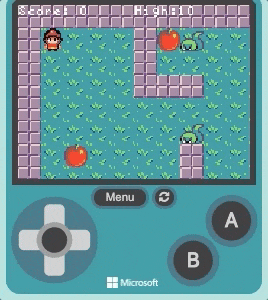

## Creating the "Hello World" game

Let’s learn how to create the game, step by step. Back up to the load screen. Game slot #2 should be available (purple color), so select that one to create a new game. (If there is no available slot, you will need to delete an existing game to make space for a new one. To delete a game, first go to one of the existing slots and select it to go to the game's home screen; then select the settings wheel and select the "delete" button. Press **A** to confirm that you want to delete the game). 

## Step 1: Pick your game characters (sprites)

Select the player, the apple, and the snake from the gallery for your game. Pick any tiles you like for the terrain. 

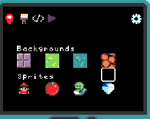

## Step 2: Build your game level/map

For this step you will need to go to the map editor. Here you can select any tile background or sprite you prefer and place it on the board. In the case of our "Hello World" game, we want the player sprite to avoid the walls, walk on grass, pick apples, and avoid snakes, so we will build our game board to support that scenario. 

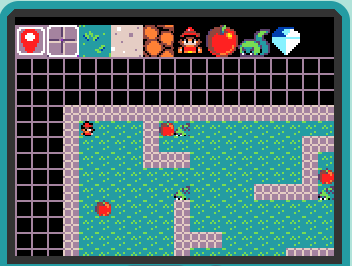

Here we have selected the apple sprite and we place a few more apple sprites on the map:

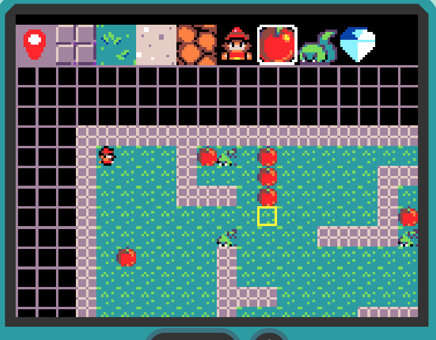

Make sure to place a player sprite on the map as well (see it in the upper left of the tile map above).

## Step 3: Make the player move. 

Now let's create our first game rule and bring the player sprite to life. Navigate to the rule selector screen. Select the **dpad right** button from the **press** rules, as shown below:

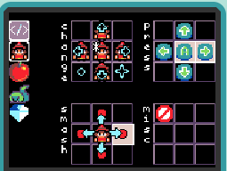

This will bring up the rule editor for the player sprite on the dpad-right press, as shown below in the **When** section. For the **Do** action, add a move right command by selecting the tile to the right of the player sprite in the **Do** section. This will bring up the command menu (shown at the top). Navigate to select the blue right arrow and then press **B** to dismiss the command menu.

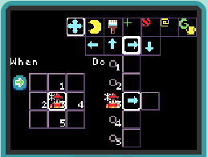

After dismissing the command menu, select the play button as shown below:

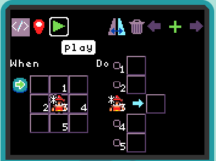

This will allow you to see the effect of the rule you just created - you can move the player sprite anywhere on the board (for the player sprite, TileCode will automatically generalize the rule to all four directions).

## Step 4: React to the board

Press the **B** button to return to the rule editor. We will now modify the rule so that the player can only walk on grass tiles. In the **When** section, select the tile to the right of the player sprite and add the grass tile by putting a green check mark on the grass background, as shown below. The **Do** section will not change.

Press the **B** button to exit the menu:

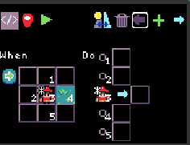

Again, select the play button to see the effect of the change to the rule. 

## Step 5: Let's eat the apples.

In order for the player to be able to eat the apples we need to create a smash rule. Return to the rule selector screen and choose one of the red dot tiles in the **smash** section, as shown below:

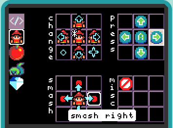

In the rule editor, select the red dot tile in the **When** section and add an apple sprite to show that we want to create a rule for when the player meets with (smashes into) the apple:

For the **Do** section we will not have any action for the player; for the apple we will have a destroy action (yellow pacman) and add a 10 points action so the player gets more points with more apples. 

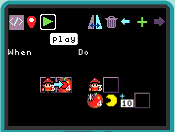

## Step 6: Don't step on a snake! 

We need to create a new smash rule for the case when a player steps on a snake. A new smash rule can be created directly from the rule editor for the smash-into-apple rule by selecting the the **+** tile in the upper right:

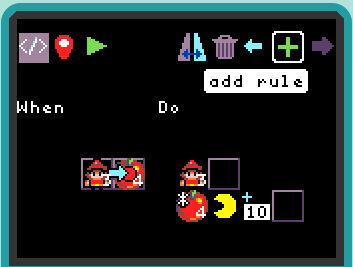

For the **When** section, select the red dot tile and add a snake sprite to show that the player is colliding into the snake. For **Do** we will not have any action for the player. For the snake we will have a game-lost action (yellow upside-down trophy) which will trigger a **game over** event. 

# Sharing Your TileCode Games {#sharing}

The easiest way to share a TileCode game you have created on an Arcade device is to copy the UF2 file from your device and share it with your friend. The UF2 file includes the flash settings in which your games are stored. When your friend copies this UF2 file to their Arcade device, they will get the games you created. Please be aware that if your friend's Arcade device is not the same as yours, this may not work.

# Having Problems? {#issues}

Please file a [GitHub issue](https://github.com/microsoft/tilecode/issues) if you encounter a problem with TileCode. You can also help us by choosing the most appropriate tag for your issue. 
