---
# this is an empty front matter
---

# Overview

TileWorld is a game creation app that allows you to design and play games directly on MakeCode Arcade devices. TileWorld games are based on the familiar paradigm of a board with pieces that can move from one tile of the board to an adjacent tile. You can run TileWorld in your [web browser](https://microsoft.github.io/pxt-tileworld/), or on any [MakeCode Arcade device](https://arcade.makecode.com/hardware). Simply copy the appropriate [UF2 file](https://github.com/microsoft/pxt-tileworld/releases/) to your MakeCode Arcade device to get started. 

* [Load Screen and Navigation](#loadscreen)
* [Overview of TileWorld Screens](#gamehome)
* [Coding in TileWorld](#coding)
* [Making Your First Game](#firstgame)
* [Sharing TileWorld Games](#sharing)
* [Having Problems?](#issues)

TileWorld can be used to introduce computational concepts and its games are simple enough to design and simulate using basic classroom materials before programming them on an Arcade device.

# Load Screen and Navigation {#loadscreen}

The load screen of TileWorld lets you select one of four games to program and play. All game assets (game board, images and code) are stored in the flash memory of your Arcade device, so your changes will remain even if you power the device off. All editing takes place via the tile paradigm: move the square-shaped cursor between adjacent tiles using the direction pad (dpad); select a tile using the A button to perform an action; the B button takes you back (to the menu of the current screen or to the previous screen). Assets are saved to flash whenever you transition between screens.

# Overview of TileWorld Screens {#gamehome}

Let's take a quick tour through the various screens you can get to from the load screen. We load the game from slot 1, which takes us to the game's home screen, as shown below:

Move the cursor around the screen to get help about all the features available. Each TileWorld game has four kinds of map tiles and four kinds of sprites to work with. Let's visit the art gallery to change the art associated with the fourth sprite (the skull).

## Gallery

We move the cursor to the puppy dog and select it (A button) 

Now, when we return to the game home screen, we can see the skull has been replaced by the puppy:

## Menu bar

The menu bar of the game screen has four main commands in addition to the gear wheel (for game settings): world map editor, paint tile/sprite art, code editor, and play game.

### Map

The map editor lets you paint the game world's tiles and place sprites on tiles. Select one of the four tiles and move your cursor down to the map. Press A to color a tile. Press B to return to the menu bar and select another tile. After selecting a sprite, the A button will place the sprite on a tile, replacing the  sprite that is there (or removing it if it is the same as the selected sprite). 

You can color tiles quickly by holding down the A button while moving the cursor. The reset button (upper right) resets the camera to the upper left of the map. To return to the game screen, press the B button (B always takes you back).

### Paint

The paint editor lets you change the art associated with a tile or sprite. As with the map editor, select the tile/sprite whose art you want to change. Here we have selected the puppy dog:

Move your cursor down to edit the bitmap (using the A button to apply the currently selected color).  Press B to move from the bitmap pane to the color selector.  Selecting a color will send the cursor back to the bitmap pane so you can quickly resume coloring where you left off. We have colored the puppy's eyes red:

### Code

The coding page shows the four kinds of sprites on the left and the different types of rules available. We have selected the boulder sprite - the highlighted squares represent the rules we have coded to give the boulder its behavior (note that there are no rules highlighted for the direction pad in the upper right).

Selecting the boulder in the middle of the upper left quadrant brings up the rule editor:

This rule applies to a boulder ``at rest'' and starts the boulder moving down when there is a space below the boulder. More details about programming rules are given below.

### Play

The play button runs the game in full screen mode. Press B to exit the game.  Try to collect all the diamonds without having a boulder fall on you or getting caught by the skull/puppy

### Settings

Once you get used to the features available in TileWorld, you can turn off the help suggestions via the gear wheel, which takes you to the settings screen. 

# Coding in TileWorld {#coding}

Each sprite's behavior is governed by a set of rules that you can program. Let's start with a fresh game. Go to the load screen and select game slot #2.  If you play the game, you'll see that you can move the player sprite around with the direction pad.  Let's look at the rules for the player sprite:

No surprises here: the rules for the direction pad (upper right quadrant) are lit up. Move the cursor over to the left dpad button:

## When Patterns

Now press A to bring up the rule editor, shown below. The menu bar shows that this rule is for the player sprite on the press of the left dpad button. Below the menu bar, the editor is divided into two sections: the *When* section shows a pattern around the player; the *Do* sections shows commands that will execute when the pattern matches. In this case, when there is no wall in the space to the left of the player sprite, the sprite is sent a move left command.

Moving the cursor to the space to the left of the player sprite and pressing A brings up the *Predicate* menu, which shows the predicate flags for each of the four tiles and sprites that could occupy the space:

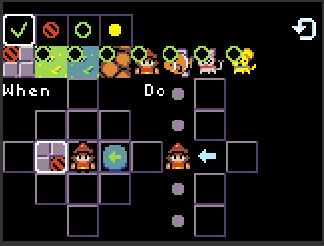

 The red circle with a slash denotes the wall tile is excluded. In other words, the predicate for the space to the left of the player matches if that space is not painted with the wall tile. If you move the cursor over the flags you will see their meaning:
* *green check mark*: one of the tile/sprites marked with a green check mark must be in the space;
* *red-slash circle*: the space must not include this tile/sprite (it is excluded from the space);
* *clear*: it doesn't matter (don't care) if the tile/sprite is in the space or not.

Try changing the flags on the tiles/sprites and see how it affects game play (remember that this rule only applies for the left dpad button). The reset button on the upper right of the attribute menu clears all the flags. Note that any space in the *When* section that is empty has no flag set, as shown for the space to the right of the player sprite:

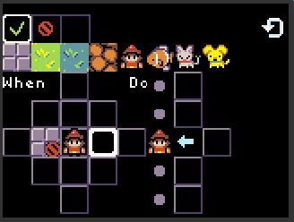

## Do Commands

If all the predicates in the *When* pattern match then the commands in the *Do* section will be executed. Otherwise, the *Do* section is ignored.  The commands of the *Do* section are organized into five rows, which correspond to the center tile and the four tiles adjacent to the center sprite. Move the cursor to the *Do* section and move the cursor up and down to see the correspondence between the rows of the *Do* section and the five tiles in the *When* section:

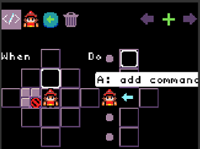

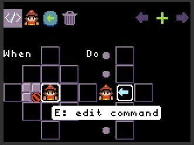

Each row can contain up to four commands. If you select the left arrow by the player sprite, you will see the other available move commands:

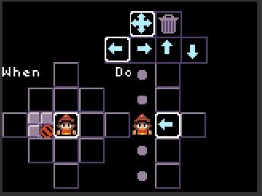

As always, press B to exit the current menu.

## Adding, Deleting and Navigating Rules

From the rule editor, you can add a rule (of the same type) by moving the cursor to the plus sign in the upper right and press A. 

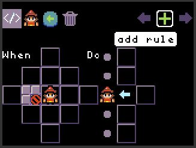

To delete the current rule, navigate to the garbage can and press A. 

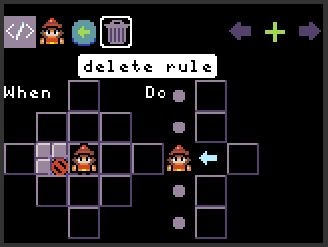

To make a rule of a different type, press the B button to return to the code screen and select a different rule type.  If you want to see all the rules for a sprite, select the sprite from the left column of the code screen and then select the code icon in the upper left.

# Your First Game {#firstgame}

Now that you've seen the basics of the code screen and the rule editor, let's create a game. We'll create game where the goal is for the player to help fish move from a small pond to a bigger pond.  Make two ponds, as shown below and put a few fish in the smaller pond:

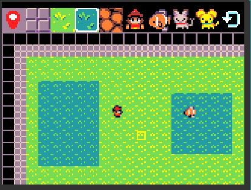

## The Player Can't Swim

In this game the player can't swim, so we'll create a rule that ends the game if the player enters the water From the code screen, select the player sprite and move to the resting rule type, as shown below:

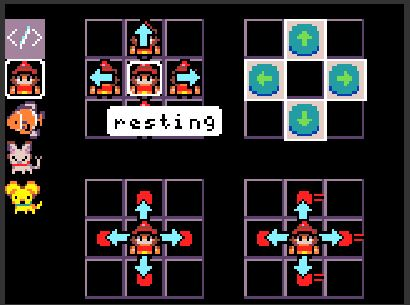

Select the space that the player is on and then select the water tile, which will apply green check mark to that tile, as shown below.

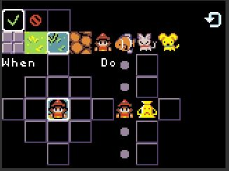

Now press the B button and move to space to the right of the player spriter in the *Do* section:

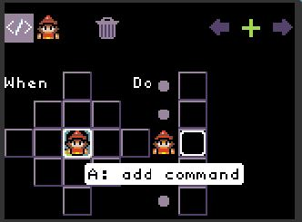

Press the A button to bring up the *Command* menu, as shown below:

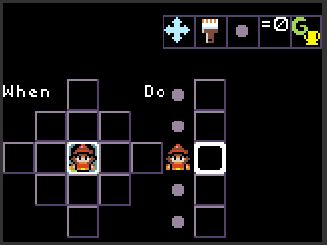

Now move the cursor the green G in the upper right of the menu:

Press the A button to list the set of game commands and move the cursor to the lose command (upside down trophy):

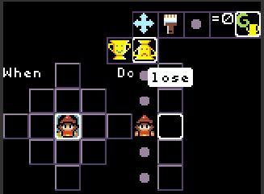

Press the A button to select this command and then press B to exit the command menu:

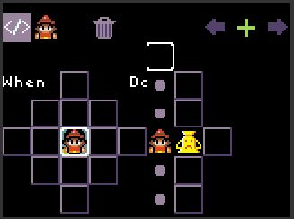

Now, go back to the game screen and play the game. See what happens if you move the player onto a water tile.

## Fish Swim Left to Right (and back again)

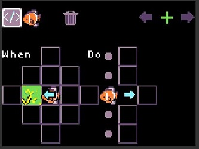
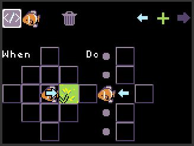
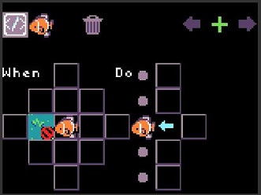
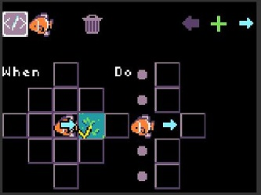

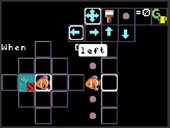
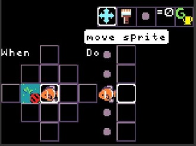

# Rule Evaluation

# Sharing Your TileWorld Games {#sharing}

The easiest way to share a TileWorld game you have created on an Arcade device is to copy the UF2 file from your device and share it with your friend. The UF2 file includes the flash settings in which your games are stored. When your friend copies this UF2 file to their Arcade device, they will get the games you created. Keep in mind that if your friend's Arcade device is not the same as yours, this may not work.

# Having Problems? {#issues}

Please file a [GitHub issue](https://github.com/microsoft/tileworld/issues) if you encounter a problem with TileWorld
